# SKN29-2nd-Project-3Team

## 프로젝트명
아파트 실거래 데이터 분석 기반 **머신러닝 인터랙티브 웹 플랫폼**
<br/>

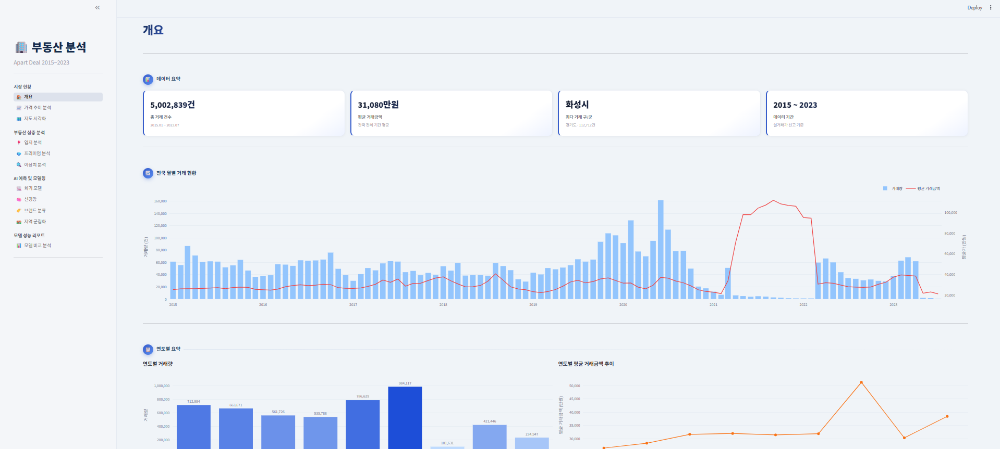

<br/>

## 프로젝트 개요
아파트 실거래 데이터(2015~2023, 약 500만 건)를 기반으로 한 **Streamlit 인터랙티브 분석 플랫폼**입니다.  
가격 예측, 브랜드 분류, 지역 군집화, 이상 거래 탐지, 저·고평가 매물 분석 등 다양한 머신러닝 모델을 웹에서 직접 체험할 수 있습니다.


<br/>

## 프로젝트 기간
2026/04/30 ~ 2026/05/04 (총 5일)

<br/>

## 프로젝트 구성원 및 역할
| 김정민 | 윤승혁 | 이지현 | 임준 |
|---|---|---|---|
|||||
|[@min1i](https://github.com/min1i)|[@idenist](https://github.com/idenist)|[@qkfmadl0-create](https://github.com/qkfmadl0-create)|[@Somber-7](https://github.com/Somber-7)|

<br/>

## 프로젝트 배경 및 필요성

부동산은 대부분의 가계에서 가장 큰 비중을 차지하는 자산임에도 불구하고, 거래 정보의 비대칭성으로 인해 개인 투자자나 실수요자가 적정 가격을 판단하기 어려운 환경이 지속되어 왔습니다.

한국 정부는 부동산 공개 API를 통해 아파트 실거래가 데이터를 제공하고 있으나, 원시 데이터 형태로 제공되어 비전문가가 직접 활용하기에는 한계가 있습니다.

본 프로젝트는 해당 공개 API 데이터를 기반으로 구축된 Kaggle 데이터셋([Korean Real Estate Transaction Data](https://www.kaggle.com/datasets/brainer3220/korean-real-estate-transaction-data/data))을 활용하였으며, 2015년부터 2023년까지 누적된 약 **500만 건**의 거래 데이터에 다양한 파생 변수를 추가적으로 생성하여 체계적으로 분석했습니다. 

이를 통해 기준금리 변동, 역세권·학세권 입지 특성, 건설사 브랜드 가치 등 복합적인 요인이 가격에 미치는 영향을 분석하고, 시장의 구조적 패턴을 도출하고자 하였습니다.

<br/>

## 프로젝트 목표
1. **아파트 거래 시장 현황 파악**: 2015~2023년 실거래 데이터를 활용하여 전국·지역별 거래 추이, 가격 변동, 입지 요인의 영향도를 시각적으로 분석
2. **거래금액 예측 모델 구축**: Linear Regression, Random Forest, LightGBM, XGBoost, PyTorch DNN 등 5가지 모델을 비교하여 아파트 적정 거래금액을 예측
3. **브랜드 가치 정량화**: XGBoost 분류 모델로 건설사 브랜드를 4단계(프리미엄·일반브랜드·공공·기타)로 분류하여 브랜드가 가격에 미치는 영향 분석
4. **저·고평가 매물 식별**: 입지·브랜드 요인을 제외한 잔차 기반 프리미엄 분석으로 시장 대비 저평가·고평가 매물을 정량적으로 도출
5. **이상 거래 탐지**: Isolation Forest 비지도 학습 모델로 전국·서울·시군구별 특이 거래를 탐지하여 시장 투명성 제고
6. **지역 특성 군집화**: PyTorch KMeans로 입지 유사성 기반 지역을 군집화하여 동일 생활권 비교 분석 지원
7. **인터랙티브 웹 플랫폼 제공**: 전문 지식 없이도 머신러닝 모델을 직접 체험하고 분석 결과를 탐색할 수 있는 Streamlit 기반 웹 애플리케이션 구축

<br/>

## 기대 효과

| 대상 | 기대 효과 |
|---|---|
| **실수요자 · 투자자** | 데이터 기반 적정가 예측 및 프리미엄 분석으로 합리적인 매수·매도 의사결정 지원 |
| **부동산 중개인** | 객관적 모델 예측값과 프리미엄 근거를 바탕으로 가격 협상력 및 고객 신뢰도 향상 |
| **정책 입안자** | 지역별 거래 추이, 기준금리·입지·브랜드 등 가격 결정 요인 분석을 통한 정책 근거 마련 |
| **시장 감독 기관** | Isolation Forest 이상치 탐지를 통한 허위·비정상 거래 식별로 부동산 시장 투명성 강화 |
| **연구자 · 개발자** | 500만 건 대규모 데이터셋 기반 다양한 ML 모델 검증 환경 및 오픈소스 분석 파이프라인 활용 |

<br/>

## 주요 기능

| 페이지 | 내용 |
|---|---|
| `홈` | 전국 거래 현황 대시보드 (월별·연도별·지역별) |
| `가격 추이 분석` | 시계열 가격 변동 및 거래량 추이 |
| `입지 분석` | 역세권·학세권·기준금리 등 입지 요소와 가격 상관 분석 |
| `지도 시각화` | Folium 기반 시군구별 평균 평당가 인터랙티브 지도 |
| `회귀 모델` | Linear / RandomForest / LightGBM / XGBoost 거래금액 예측 |
| `분류 모델` | XGBoost 기반 브랜드 등급(4단계) 분류 |
| `군집화` | KMeans 기반 입지 특성별 지역 군집 분석 |
| `신경망 (DNN)` | PyTorch DNN 기반 거래금액 예측 |
| `모델 분석`| 전 모델 성능 지표 비교 |
| `저·고평가 분석` | 입지·브랜드 가치 대비 저평가/고평가 매물 분석 |
| `이상치 분석` | Isolation Forest 기반 특이 거래 탐지 |

*※ 메인기능 시각화 화면은 최하단을 참고해주세요*

<br/>


## 기술 스택

| 구분 | 사용 기술 |
|---|---|
| 웹 | Streamlit |
| ML | scikit-learn, LightGBM, XGBoost |
| 딥러닝 | PyTorch |
| 데이터베이스 | MySQL |
| 시각화 | Plotly, Folium |
| 데이터 | pandas, numpy |

<br/>

## 디렉토리 구조

```
SKN29-2nd-3Team/
│
├── app/                            # Streamlit 웹 애플리케이션
│   ├── Home.py                     # 메인 대시보드
│   ├── pages/
│   │   ├── 1_가격추이분석.py
│   │   ├── 2_입지분석.py
│   │   ├── 3_지도시각화.py
│   │   ├── 4_회귀모델.py
│   │   ├── 5_분류모델.py
│   │   ├── 6_군집화.py
│   │   ├── 7_신경망.py
│   │   ├── 8_모델분석.py
│   │   ├── 9_프리미엄분석.py       # 저·고평가 분석
│   │   └── 10_이상치분석.py
│   └── components/                 # (공통 UI 컴포넌트 예약)
│
├── models/                         # 머신러닝 모델
│   ├── base.py                     # 추상 베이스 클래스 (BaseModel)
│   ├── regression/
│   │   ├── price_regression_models.py   # Linear / RF / LightGBM / XGBoost
│   │   ├── dnn_regressor.py             # PyTorch DNN 회귀
│   │   └── price_premium_analyzer.py    # 저·고평가 프리미엄 분석
│   ├── classification/
│   │   └── brand_grade_classifier.py    # 브랜드 등급 XGBoost 분류
│   ├── clustering/
│   │   ├── location_cluster_models.py   # MiniBatchKMeans 지역 군집화
│   │   └── torch_kmeans_models.py       # PyTorch KMeans 구현
│   └── anomaly/
│       ├── anomaly_transaction_model.py          # 전국 이상치 탐지
│       ├── seoul_anomaly_transaction_model.py    # 서울 특화
│       └── location_anomaly_transaction_model.py # 시군구별 특화
│
├── utils/
│   ├── db.py           # MySQL 연결 + Parquet 캐시 (load_apart_deals)
│   ├── preprocessor.py # 전처리 헬퍼
│   ├── metrics.py      # 회귀·분류·군집 평가지표
│   ├── visualizer.py   # Plotly 시각화 함수
│   └── ui.py           # Streamlit 공통 UI (사이드바, 헤더, 카드)
│
├── scripts/
│   ├── insert_data.py          # CSV → MySQL 배치 적재 (~500만 건)
│   ├── build_sigungu_stats.py  # 시군구별 통계 테이블 생성
│   ├── save_models.py          # 모델 학습 및 pkl 저장 (분류·군집·프리미엄)
│   ├── train_dnn.py            # DNN 모델 학습 및 저장
│   ├── precompute_anomaly.py   # 이상치 결과 사전계산 및 캐시
│   ├── test_classification.py  # 분류 모델 테스트
│   ├── test_clustering.py      # 군집화 모델 테스트
│   └── _common.py              # 스크립트 공용 유틸
│
├── data/
│   ├── raw/                    # 원본 ZIP 파일 (Apart Deal_1~5.zip)
│   ├── processed/
│   │   └── Apart Deal_6.csv    # 전처리 완료 통합 데이터 (~500만 건)
│   ├── cache/                  # 사전계산 캐시 (parquet, json)
│   └── models/                 # 학습된 모델 pkl/pt 저장소
│       ├── LinearRegression_model.pkl
│       ├── RandomForest_model.pkl
│       ├── LightGBM_model.pkl
│       ├── XGBoost_model.pkl
│       ├── dnn_regressor.pt
│       ├── dnn_regressor_meta.json
│       ├── brand_grade_classifier.pkl
│       ├── torch_kmeans_clustering.pkl
│       └── premium_analysis_results.pkl
│
├── sql/
│   ├── ddl/create_db.sql       # DB·테이블 생성 (tbl_apart_deals, tbl_sigungu_stats)
│   └── dml/                    # 초기 데이터 (insert_data.py로 처리)
│
├── conf/
│   └── .env                    # DB 접속 정보 (gitignore 처리됨)
│
├── assets/
│   └── css/style.css           # Streamlit 커스텀 스타일
│
└── requirements.txt
```

<br/>

## 데이터 흐름

```
원본 ZIP (data/raw/)
    ↓
[scripts/insert_data.py]
    ↓
MySQL (tbl_apart_deals, ~500만 건)
    ↓
[utils/db.py] load_apart_deals()  →  data/cache/apart_deals.parquet
    ↓
[scripts/save_models.py]           # 모델 학습 및 사전계산
    ↓
data/models/*.pkl                  # 저장된 모델·분석 결과
    ↓
Streamlit 페이지 (즉시 로드)
```

<br/>

## 데이터 전처리

원본 데이터(Kaggle - Korean Real Estate Transaction Data, 5,002,839건)는 총 **5단계 CSV 전처리**와 **ML 파이프라인 전처리**를 거쳐 모델 학습에 투입됩니다.

<br/>

### CSV 구축 단계 (Apart Deal_1 → 6) — 추가 컬럼 9개

| 단계 | 담당 | 추가 컬럼 | 원본 컬럼 | 내용 |
|---|---|---|---|---|
| Step 1 | 임준 | `시군구` | `지역코드` | 지역코드(5자리) → 시군구 명칭 매핑, 거래일 형식 통일(YYYY-MM-DD) |
| Step 2 | 김정민 | `기준금리` | `거래일` | 거래일 기준 한국은행 기준금리 매핑 (0.5%~3.5%) |
| Step 3 | 임준 | — | — | 행정구역 개편(강원·전북 특별자치도) 반영, 시군구 결측 377,261건 보완 |
| Step 4-1 | 임준 | `위도` `경도` | `시군구` `법정동` `지번` | 원본 컬럼을 통해 주소를 알아낸 뒤 지오코딩을 통한 위경도 추가 |
| Step 4-2 | 윤승혁 | `인근학교수` `인근역수` | `위도` `경도` | 아파트 좌표를 통해 반경 750m 내 학교·역 수 |
| Step 4-3 | 이지현 | `세대수` | `시군구` `거래일` | 시군구 시계열 데이터와 거래일을 매칭하여 해당 지역의 세대수 정리 |
| Step 5 | 김정민 | `브랜드` `브랜드여부` | `아파트명` | 아파트명 키워드 64개 규칙으로 61개 브랜드 분류, 이진 플래그 생성 |

<br/>

### ML 파이프라인 단계 — 파생변수 12개

| 구분 | 파생변수 | 원본 컬럼 | 생성 방법 |
|---|---|---|---|
| 날짜 | `거래연도` | 거래일 | 연도 추출 |
| 날짜 | `거래월` | 거래일 | 월 추출 (1~12) |
| 날짜 | `거래분기` | 거래일 | 분기 추출 (1~4) |
| 건물 | `건물연식` | 건축년도 | 기준연도 − 건축년도 |
| 브랜드 | `브랜드구분` | 브랜드 | 브랜드명 → 4등급 (프리미엄 / 일반브랜드 / 공공(LH) / 기타) |
| 입지 | `역세권여부` | 인근역수 | 인근역수 ≥ 1 이면 1, 아니면 0 |
| 입지 | `학세권여부` | 인근학교수 | 인근학교수 ≥ 3 이면 1, 아니면 0 |
| 입지 | `대단지여부` | 세대수 | 세대수 ≥ 1,000 이면 1, 아니면 0 |
| 프리미엄 | `예측거래금액` | — | XGBoost 모델 예측값 (입지·브랜드 독립 피처 기반) |
| 프리미엄 | `프리미엄금액` | 거래금액, 예측거래금액 | 실제 거래금액 − 예측거래금액 |
| 프리미엄 | `프리미엄률` | 프리미엄금액, 예측거래금액 | 프리미엄금액 / 예측거래금액 |
| 프리미엄 | `프리미엄등급` | 프리미엄률 | 5구간 분류 (큰 할인 / 할인 / 보통 / 프리미엄 / 고프리미엄) |

> 각 단계별 결측치 현황, 이상치 분포, 담당자 및 세부 처리 근거는 [docs/데이터_전처리_전체_과정.md](docs/데이터_전처리_전체_과정.md)를 참고하세요.

<br/>

## 시작하기

### 1. 패키지 설치

```bash
pip install -r requirements.txt
```

### 2. 환경 설정

`conf/.env` 파일에 MySQL 접속 정보를 입력합니다.

```env
DB_HOST=localhost
DB_PORT=3306
DB_USER=root
DB_PASSWORD=yourpassword
DB_NAME=yourdbname
```

### 3. DB 초기화 및 데이터 적재

```bash
# 테이블 생성
mysql -u root -p < sql/ddl/create_db.sql

# CSV → MySQL 적재 (약 10~20분 소요)
python scripts/insert_data.py

# 시군구 통계 테이블 생성
python scripts/build_sigungu_stats.py
```

### 4. 모델 학습 및 사전계산

```bash
# 분류·군집화·프리미엄 분석 모델 저장
python scripts/save_models.py

# DNN 모델 학습
python scripts/train_dnn.py

# 이상치 탐지 결과 사전계산
python scripts/precompute_anomaly.py
```

### 5. Streamlit 앱 실행

```bash
cd app
streamlit run Home.py
```

<br/>
<br/>

## 모델 요약

| 모델 | 유형 | 대상 | 저장 파일 | 채택한 이유와 장점 | 한계점 및 통제방안 |
|---|---|---|---|---|---|
| Linear Regression | 회귀 | 거래금액 예측 | `LinearRegression_model.pkl` | 해석이 직관적이며 계수를 통해 피처 영향력 파악 가능. 베이스라인 성능 기준점으로 활용. | 비선형 관계 포착 불가. 다중공선성에 취약하며 이상치에 민감. |
| Random Forest | 회귀 | 거래금액 예측 | `RandomForest_model.pkl` | 비선형 패턴 학습 가능하며 피처 중요도 제공. 과적합에 강한 앙상블 구조. | 학습·예측 속도 느림. 대용량 데이터에서 메모리 사용량 높음. |
| LightGBM | 회귀 | 거래금액 예측 | `LightGBM_model.pkl` | 높은 예측 정확도와 빠른 학습 속도. 범주형 변수 내장 처리 및 대용량 데이터에 최적화. | 하이퍼파라미터 민감도 높음. 과적합 방지를 위해 조기 종료 등 튜닝 필요. |
| XGBoost | 회귀 | 거래금액 예측 | `XGBoost_model.pkl` | 정규화 내장으로 과적합 억제. LightGBM과 상호 보완적 비교 모델로 활용. | LightGBM 대비 학습 속도 느림. 대규모 데이터에서 메모리 사용량 증가. |
| DNN (PyTorch) | 회귀 | 거래금액 예측 | `dnn_regressor.pt` | 복잡한 비선형 관계를 다층 구조로 학습. GPU 가속으로 대용량 학습 가능. | 블랙박스 모델로 해석 어려움. 트리 기반 모델 대비 표 형식 데이터에서 성능 저하 경향. |
| XGBoost | 분류 | 브랜드 등급 (4클래스) | `brand_grade_classifier.pkl` | 다중 클래스 분류에 강하고 불균형 클래스 처리 용이. 피처 중요도로 브랜드 가치 요인 파악. | 브랜드 등급 기준이 데이터 기반 라벨링이라 주관적 요소 포함 가능. |
| KMeans (PyTorch) | 군집화 | 입지 특성 군집 | `torch_kmeans_clustering.pkl` | GPU 가속으로 대용량 데이터 군집화 가능. 입지 유형별 패턴을 비지도 방식으로 발견. | K값 사전 지정 필요. 구형 군집 가정으로 복잡한 경계 형태 표현 한계. |
| Isolation Forest | 이상치 탐지 | 특이 거래 탐지 | 캐시(parquet/json) | 비지도 학습으로 라벨 불필요. 고차원 데이터에서도 이상치를 효율적으로 탐지. | 이상치 기준이 통계적 이상이며 실제 허위거래와 다를 수 있음. 임계값 조정 필요. |
| XGBoost + 프리미엄 | 저·고평가 분석 | 적정가 대비 프리미엄 | `premium_analysis_results.pkl` | 입지·브랜드 요인을 제외한 잔차로 순수 프리미엄 측정. 200K 샘플로 96% 데이터 누출 방지. | 학습 샘플 외 데이터는 외삽 예측으로 정확도 저하 가능. 시장 사이클 변동 미반영. |

<br/>
<br/>

## 메인 기능 시각화 화면
### 1️⃣시장현황
||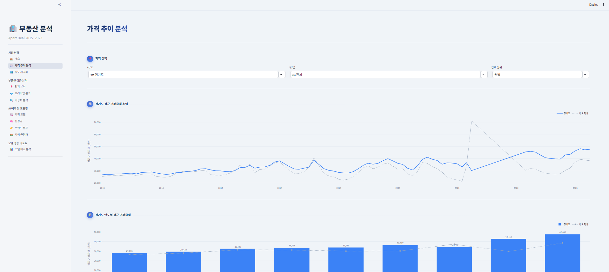|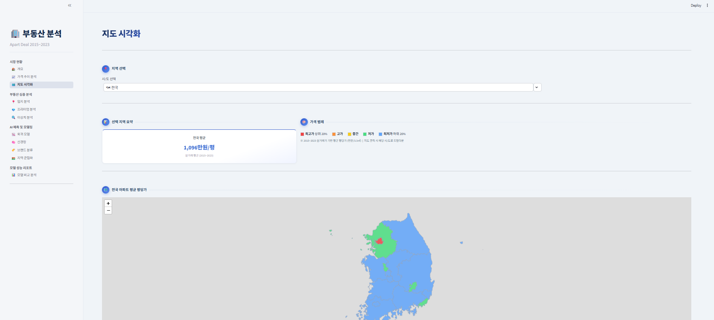|
|---|---|---|
### 2️⃣부동산 심층 분석
|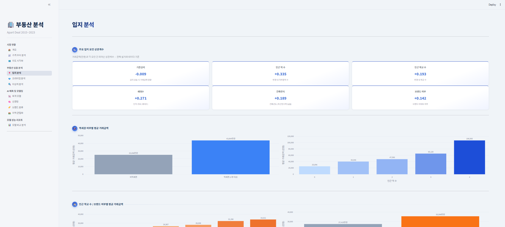|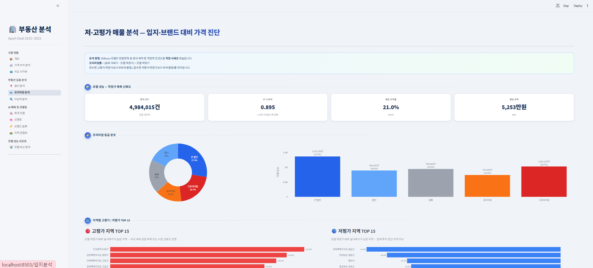|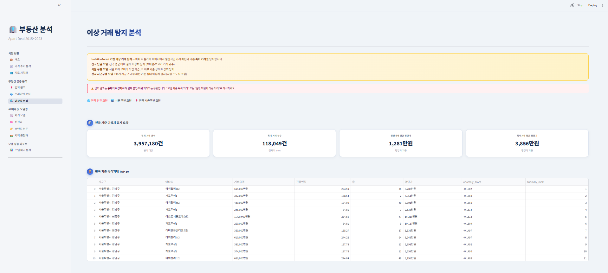|
|---|---|---|
### 3️⃣AI 예측 및 모델링
|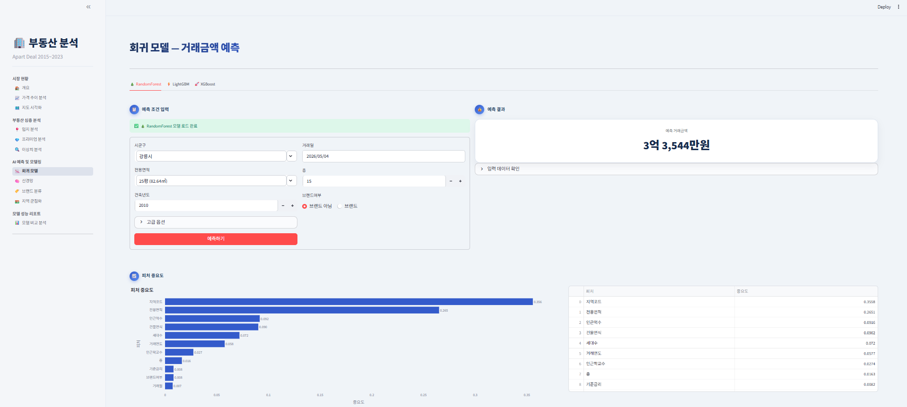|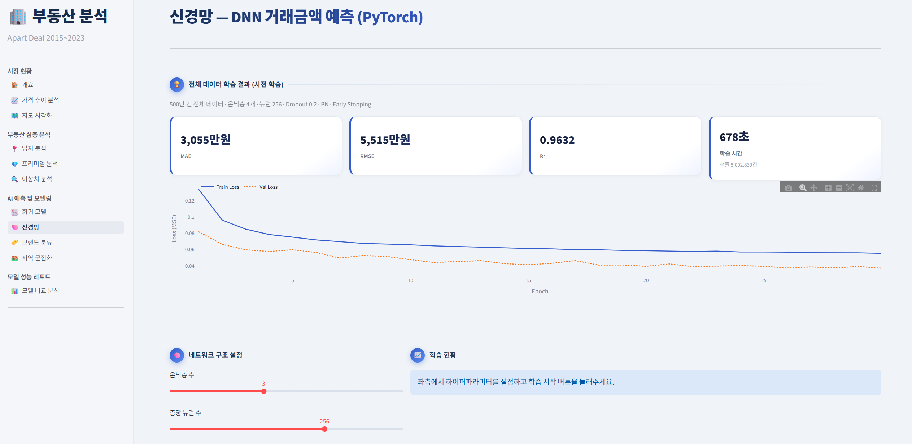|
|---|---|
|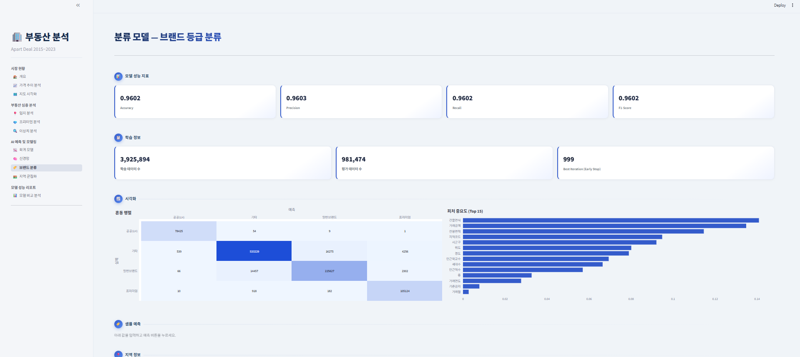|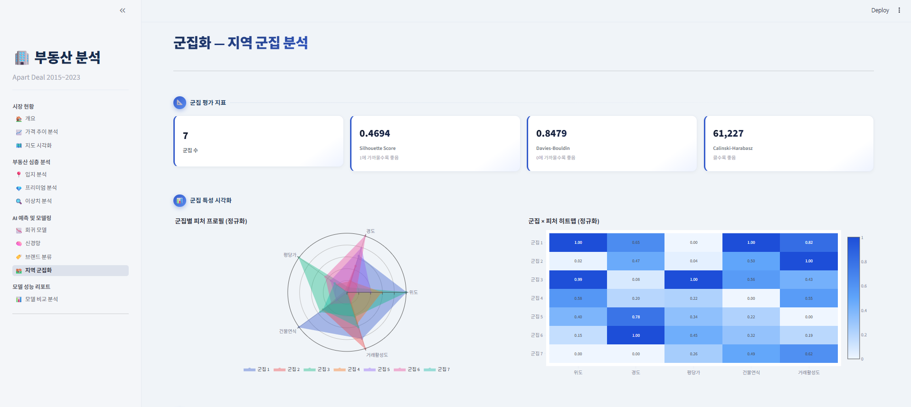|
|---|---|
### 4️⃣모델 성능 리포트
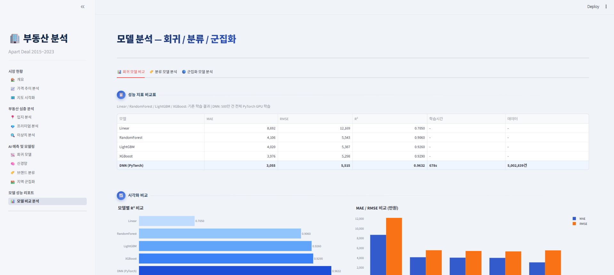
